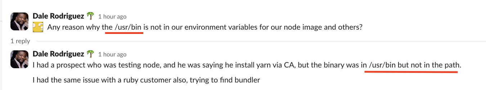

# Bash

*By the end of this lab, you will:*
1. Be familiar with the Bash commands we'll use in this course, and a little about the linux file system structure
1. Have a "local" development environment set up


# 🐧 Intro to GNU/Linux – Commands & Key Terms

This reference is designed to help beginners get comfortable with the Linux command line. It includes essential commands and key terms to prepare you for hands-on exercises.

---

## Basic GNU/Linux Commands

### Essential Commands

- `cd` – Change the current directory
- `ls` – List the contents of a directory
- `pwd` – Show the full path of the current working directory
- `cp` – Copy a file or folder
- `mv` – Move or rename a file or folder
- `rm` – Remove a file or folder *(use with caution)*
- `mkdir` – Make a new directory
- `touch` – Create an empty file
- `cat` – Display the contents of a file in the terminal window
- `echo` – Print text or variables to the terminal window
- `man` – Show the manual/help for a command
- `wget` - Download files from the web
- `chmod` – Change permissions on a file or folder
- `chown` – Change ownership of a file or folder


<details>
  <summary> 
  <strong>Advanced, "ask AI" questions</strong></summary>
  - Q: 
  
  Why is 'chroot' command important for Chainguard?

  - `chroot` – Run a command with a different root directory  
    This is used to "jail" a process in a different filesystem view. Common in minimal container-like setups, or Linux-from-scratch systems. Requires root access and caution.
</details>


---

## Key GNU/Linux Terms

- **terminal** – A text-based interface to interact with the system (e.g., Bash, Zsh)
- **prompt** – Where you type commands in the terminal
- **shell** – The program that interprets commands in the terminal (e.g., Bash, Zsh)
- **user** – A person or process that uses the system and has permissions
- **home directory** – A user's personal folder, usually located at `~/`
- **path** – A file or folder's location in the system (e.g., `/etc/passwd`)
- **root** – The top-level directory `/` and/or the superuser account
- **permissions** – Rules that control who can read/write/execute files
- **process** – A running instance of a program
- **service (daemon)** – A background process that supports core functions
- **environment** – The operating system’s configuration: users, processes, files, etc.
- **package manager (OS level)** – Tool to install and manage software (e.g., `apt`, `apk`, `dnf`)
- **package manager (application level)** – Also to install and manage software (e.g., `pip`, `npm`, `maven`)


<details>
  <summary> 
  <strong>Advanced, "ask AI" questions</strong></summary>
  Q:
  
  What's the difference between OS level and application level package managers? Why is this important to understand for Chainguard?

  Q:
  
  Do Chainguard solutions address application level software? Or only OS level software?

  Q:

  For Chainguard base images, if someone adds their own custom application with app-level dependencies to that base image, does chainguard secure the application level dependencies?

  Q:

  In Chainguard's Python image for example, is Chainguard securing and updating OS level dependencies and also Python dependencies? If so, which Python dependencies? Standard deps? 3rd party deps?
</details>

---

### Filesystem, Directories, and Navigation

Open your terminal (zshell terminal for MacOS, Bash terminal for Linux)


When you first open it, you should see your prompt:

**anthony.sayre@AnthonySayres-MacBook-Pro ~ %**

Q: What is **~**?

A: **~** (tildae) is shorthand for your 'home' directory

See what the longhand for your home directory is by typing:

```bash
pwd
```
> 'pwd' stands for 'print working directory', it will 'print' the lon version of the /path/to/whatever/directory you are currently in

for MacOS, 'home' is: `/Users/username`  

for Linux OS, 'home' is: `/home/username`

Q: What do we mean when we say 'home', 'directory', or 'path'?

A: **Understanding the Linux directory structure (a set of organized folders):**


[The Filesystem Hierarchy Standard (FHS)](https://www.linuxtrainingacademy.com/linux-directory-structure-and-file-system-hierarchy/)


### It's file systems all the way down:

No matter what kind of computer your application is running on (HW, VM, Container), it will be using some variation on the concept of the Linux file system...


Many technical concepts can be boiled down to creating/editing files, moving files, turning files into executable programs, applying underlying OS services and processes to files.

<details>
  <summary> 
  <strong>Advanced, "ask AI" questions</strong></summary>

Q:

What types of things use an Operating System (OS) and its underlying file system? Split the answer under three main types: Hardware devices, VMs, and Containers and describe how the OS for each interacts with the linux hierarchical file system.

I am a customer-facing post-sales account manager just starting to learn Linux, Bash, Git, and containers, so keep the answer basic
</details>

---

### Absolute Pathing vs Relative Pathing 

Let's navigate around a little from your terminal prompt. We'll use the 'change directory' (cd) command and give it a path to a new location in the directory.

Relative pathing starts from wherever *you* are in the directory

```bash
cd ../..
```
> - Note: **'cd'** means 'change directory', 
> - **'..'** means 'one level above where you are in the hierarchy'

Q: Now what does your prompt show?

A: **...MacBook-Pro / %**

You just changed directories (moved up two levels from where you were in the hierarchy) using **relative pathing**, your nworking directory is now **root** or **/**

Show what is in the `/` directory:

```bash
ls
```

Now lets go back to our home directory:

```bash
cd ~
```

Go to **etc** using relative pathing:

```bash
cd ../../etc
```

> hint: type part of the command and then press <tab> key to autocomplete

See what's there:

```bash
ls
```

Look at a file:

```bash
cat passwd
```

Go back to your home folder:

```bash
cd ~
```


Now lets try absolute pathing to get to the same place:

```bash
cd /etc
```

List out a more detailed view of the contents of **etc**

```bash
ls -la
```

Go back to home again:

```bash
cd /Users/<your user name>
```

Ensure you really got back to your home folder by reviewing your prompt, does it look like this?:

**...MacBook-Pro ~ %**

If so then success!

> Note: You don't have to navigate to a directory to read files inside that directory
> 
> ---
> Q: How could we use the 'cat' command and pathing to read the same 'passwd' file inside the **etc** folder?

### (When the above question is answered you are done with this exercise)

---

#### Make a new directory to house your coursework

```shell
mkdir ~/chainguard-app-building
```

> `mkdir` is the command to make a new directory

- `chainguard-app-building` is the new directory we're creating.  `~/chainguard-app-building` is the full path of the new directory.  Again the tildae (~) is short-hand for /Users/your_user_name

So...

`/Users/your_user_name/chainguard-app-building` 

is the same thing as...

`~/chainguard-app-building`


Ensure you are in your "home" directory and make a new sub-directory in it

```shell
cd ~
mkdir chainguard-app-building
```

### Variables (vars):

Call a system environment variable:

```bash
echo $USER 
```

> Note: the $USER variable comes standard with all Linux OS variants as well as all MacOS (Windows uses $USERNAME at Cmd Prompt)

results:

```
anthony.sayre
```

Add your own custom variable:

```bash
export NAME=Frodo
```

This sets `$NAME` to `Frodo`

Ensure it worked:

```bash
echo $NAME
```

result:

```
Frodo
```

You can see all the environment variables with the `env` command:

```bash
env
```

result:
```
__CFBundleIdentifier=com.apple.Terminal
TMPDIR=/var/folders/tx/mc65575x5ll5k7_y70mmdbyw0000gn/T/
XPC_FLAGS=0x0
LaunchInstanceID=5947A3B0-4DE5-4FD9-A204-EA0F32CCEE90
TERM=xterm-256color
SSH_AUTH_SOCK=/private/tmp/com.apple.launchd.5K6SiNW5Wd/Listeners
SECURITYSESSIONID=186b5
XPC_SERVICE_NAME=0
TERM_PROGRAM=Apple_Terminal
TERM_PROGRAM_VERSION=455.1
TERM_SESSION_ID=A8D55C57-3192-4D91-B042-46D430109353
SHELL=/bin/zsh
HOME=/Users/anthony.sayre
LOGNAME=anthony.sayre
USER=anthony.sayre
PATH=/opt/homebrew/bin:/opt/homebrew/sbin:/usr/local/bin:/System/Cryptexes/App/usr/bin:/usr/bin:/bin:/usr/sbin:/sbin:/var/run/com.apple.security.cryptexd/codex.system/bootstrap/usr/local/bin:/var/run/com.apple.security.cryptexd/codex.system/bootstrap/usr/bin:/var/run/com.apple.security.cryptexd/codex.system/bootstrap/usr/appleinternal/bin:/usr/local/go/bin:/Users/anthony.sayre/go/bin
SHLVL=1
PWD=/Users/anthony.sayre/git/app-building-for-chainguard-success-managers
OLDPWD=/Users/anthony.sayre/git
HOMEBREW_PREFIX=/opt/homebrew
HOMEBREW_CELLAR=/opt/homebrew/Cellar
HOMEBREW_REPOSITORY=/opt/homebrew
INFOPATH=/opt/homebrew/share/info:
NAME=Frodo
LANG=en_US.UTF-8
_=/usr/bin/env

```

> Q: Is your $NAME variable listed there?


---

### Environment Management

##### Shell-wide environment

When you want a variable or other configuration available to you permanently, you can set an environment variable in your `~/.zshrc` file.  Because this file is loaded every time you log in, you'll always have your customizations available.

We're all going to pick a unique [MacGuffin](https://en.wikipedia.org/wiki/MacGuffin) that will identify resources we create in our shared environment.

```shell
# Choose a unique MacGuffin to identify your resources.
# To be safe, use all lower case letters (no numbers or special chars)
echo 'export MACGUFFIN=Linky' >> ~/.zshrc
# EDIT this expression before running it:
# - replace 'Linky' with your unique MacGuffin: 'ring', 'rug', 'time', your initials, whatever

# print the contents of the .zshrc file to console, to ensure the command worked
cat ~/.zshrc 

# Verify
echo $MACGUFFIN

# Q: Is it there? Why not?

# Tell your shell to reload your .zshrc file
source ~/.zshrc

# Reverify
echo $MACGUFFIN

# Q: Is it there now? Why?
```
---

### Chainguard at command line

Ensure chainctl is [installed locally](https://edu.chainguard.dev/chainguard/chainctl-usage/how-to-install-chainctl/)

Easiest on a Mac is:

```bash
brew tap chainguard-dev/tap
brew install chainctl
```

However, what if you are working in a system that does not have this package manager? Or you need a process that can work across systems with many different package managers? Homebrew works on a Mac only. Not practical if I need things to work across Mac, Linux, Windows, etc...

Let's try to install this using a commands that can work without OS specific package managers. We'll use a cloud shell so as not to mess with your Mac environment.

Go to your [Chainguard Google account](https://console.cloud.google.com/) and sign-in

Click to activate your Google Cloud Shell:

> Note: Upper right corner


Enter this command at the cloud shell prompt:

```bash
wget https://dl.enforce.dev/chainctl/latest/chainctl_linux_x86_64
```

Verify the file downloaded, and review the permissions on the file:
```bash
ls -l
```

Result:
```
-rw-rw-r-- 1 anthony_sayre anthony_sayre 73584824 Jun 20 21:30 chainctl_linux_x86_64
-rwxr-xr-x 1 anthony_sayre anthony_sayre      913 Jun 22 22:07 README-cloudshell.txt
```

Notice that the chainctl binary is present but does not have the execute permission. We want to see some x's in the permission section (which means executable). Until then, we cannot do anything with this binary.

Make it executable:
```bash
chmod +x chainctl_linux_x86_64 
```

Review the permissions again:
```bash
ls -l
```

Result:
```
-rwxrwxr-x 1 anthony_sayre anthony_sayre 73584824 Jun 20 21:30 chainctl_linux_x86_64
-rwxr-xr-x 1 anthony_sayre anthony_sayre      913 Jun 22 22:07 README-cloudshell.txt
```

Notice the binary file `chainctl_linux_x86_64` now had **x's** in the permissions section, the file is now an **executable program** in this environment.

However, we should move it to a directory where we normally keep executable binaries.

There are a few places we could put it. Review what they are by examining the $PATH variable

```bash
echo $PATH
```

Result:
```
/opt/gradle/bin:/opt/maven/bin:/usr/local/sbin:/usr/local/bin:/usr/sbin:/usr/bin:/sbin:/bin:/usr/local/go/bin:/usr/local/node_packages/node_modules/.bin:/usr/local/rvm/bin:/home/anthony_sayre/.gems/bin:/usr/local/rvm/bin:/home/anthony_sayre/gopath/bin:/google/gopath/bin:/google/flutter/bin:/usr/local/nvm/versions/node/v22.16.0/bin
```

> Note: We could move the binary file to any one of the paths specified above ^^
> The result will make it callable from anywehre in the file system (just like the other core utils)

Let's move it to `/usr/local/bin/`

```bash
mv chainctl_linux_x86_64 /usr/local/bin/
```

Q: Did it work?

Try again with `sudo` in front of the command:
```bash
sudo mv chainctl_linux_x86_64 /usr/local/bin/
```
> Note: 'sudo' command elevates your user privileges to 'root' or 'admin' level, you can do anything

Now make sure you can really call the binary/command:

```bash
chainctl_linux_x86_64 --help
```

> Note: If you get the help menu for the chainctl utility, it worked!


This stuff comes up more than we think...



[Link to full slack convo](https://chainguard-dev.slack.com/archives/C04PYHWPE1F/p1750880117172019)

<details>
  <summary> 
  <strong>Advanced, "ask AI" questions</strong></summary>
Context: 

Here's a thread about /usr/bin and usr/sbin, soft links, and the contents of the $PATH env var between some technical team members at Chainguard. 

I am new to Linux but work at Chainguard with technical customers.

Q:

Can you explain this conversation to me?

Thread:

Team Member 1:
Any reason why the /usr/bin is not in our environment variables for our node image and others?

I had a prospect who was testing node, and he was saying he install yarn via CA, but the binary was in /usr/bin but not in the path.
I had the same issue with a ruby customer also, trying to find bundler


Team Member 2:

It looks like /usr/sbin is a soft link to /usr/bin
And /usr/sbin is in the path so anything in /usr/bin should effectively be in the path because of this.

Command:

```bash
/usr $ ls -la /usr
```


Result:

```
total 40
drwxr-xr-x  1 root   root     4096 May 1 2024 .
drwxr-xr-x  1 root   root     4096 Jun 25 22:20 ..
drwxr-xr-x  1 root   root     4096 Jun 17 13:28 bin
drwxr-xr-x  1 root   root     4096 Jun 10 21:05 include
drwxr-xr-x  1 root   root     4096 Jun 8 16:23 lib
lrwxrwxrwx  1 root   root       3 Mar 31 13:08 lib64 -> lib
drwxr-xr-x  1 root   root     4096 Jun 16 20:24 libexec
drwxr-xr-x  1 root   root     4096 May 28 13:35 local
drwx------  1 man   man      4096 Jan 1 1970 man
lrwxrwxrwx  1 root   root       3 Mar 31 13:08 sbin -> bin
drwxr-xr-x  1 root   root     4096 May 1 2024 share
drwxr-xr-x  1 root   root     4096 Jun 17 13:28 x86_64-pc-linux-gnu
/usr $ printenv
HOSTNAME=d88fa38a25de
SHLVL=1
HOME=/home/node
OLDPWD=/usr/sbin
SSL_CERT_FILE=/etc/ssl/certs/ca-certificates.crt
TERM=xterm
PATH=/usr/local/sbin:/usr/local/bin:/usr/bin:/usr/sbin:/sbin:/bin
NPM_CONFIG_UPDATE_NOTIFIER=false
PWD=/usr

```

4:24
yep if i copy a new binary to /usr/bin it seems to be in the path

```
/app # cp /usr/bin/wget /usr/bin/wget2
/app # wget2 
wget2: missing URL
Usage: wget2 [OPTION]... [URL]...

Try `wget2 --help' for more options.
```

End of thread


Q:

Also, how can Team Member 2 tell that `usr/sbin` is a 'soft link' to `usr/bin`?

</details>

#### End of Lab

---
<details>
  <summary> 
  <strong>Self-Study and/or Extra Credit</strong></summary>

More notes on directories and the filesystem

An Unusual Class Convention:

> In this class, you will find instructions like this:

```shell
touch ~/chainguard-app-building/mywebserver/deploy/Chart.yaml
```
> This command should fail because the subdirectory 'mywebserver' has not been created yet

> You can do two commands on a single terminal command by using '&&'. The below compound command is a combo of `mkdir` and `touch` commands:

```bash
mkdir -p ~/chainguard-app-building/mywebserver/deploy/ && touch ~/chainguard-app-building/mywebserver/deploy/Chart.yaml
```

The command should work this time

```bash
open -a TextEdit ~/chainguard-app-building/mywebserver/deploy/Chart.yaml
```

We used absolute paths for this

Sometimes we use absolute paths because it's exceptionally clear, and it will work even if you've wandered into a different directory at some point

If you prefer to type instead of copy/paste, something like this will yield the same results:

Use 'tab' to navigate through the `cd` command....

```shell
cd ~/chainguard-app-building/mywebserver/deploy
touch Chart.yaml
open -a TextEdit Chart.yaml
```

### Command tricks

##### Autocomplete

- Try using the `Tab` key to autocomplete paths or commands
  - Type `cd ~/chaingu` without pressing Enter.  Press `Tab` instead.
  - Try typing `echo $USE` and pressing `Tab`.

##### Command history

- You can type the up and down arrows to cycle through previous commands
- Bash variables
  - `!!` will re-run the last command
  - `!$` or `$_` will insert the last argument of the previous command:

    ```shell
    touch Chart.yaml
    open -a TextEdit !$
    ```

  - `!<search_string>` will immediately re-run the most recent command **starting** with `<search_string>` (risky, but handy for non-destructive things like `!edit` or `!vim`)
  - `!?<search_string>` will immediately re-run the most recent command **containing**  `<search_string>` (risky)
  - Some shells (like ZSH) will help protect you by expanding these found commands at the prompt; you have to hit Enter again to run them.
- CTRL+R
  - To search for and re-run a previous command, press CTRL+R, then type part of the command you want to re-run
  - A matching command should appear
  - Press CTRL+R again to cycle through earlier matching commands

</details>
---

|Next: [GitHub](/labs/01_github)|
|:---:|