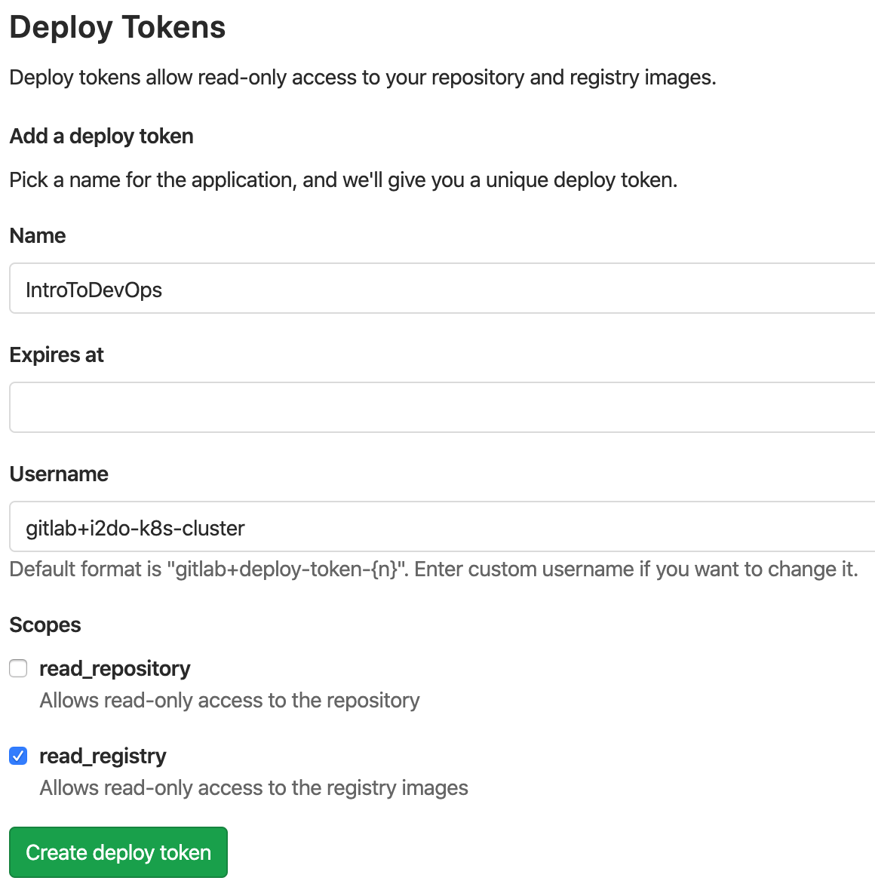
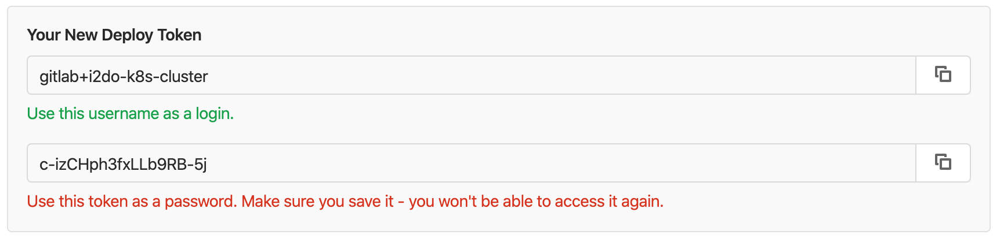

# Accessing a Private Registry from Kubernetes

*By the end of this lab, you will:*

- Install your GitLab Docker registry credentials in your K8s cluster
- Launch your custom webserver on your Kubernetes cluster

---

Our webserver is in a private repository.  We need to [give Kubernetes access](https://kubernetes.io/docs/tasks/configure-pod-container/pull-image-private-registry/).  We will do so with a [Deploy Token](https://docs.gitlab.com/ee/user/project/deploy_tokens/) from our GitLab project.


### A Deploy Token for Kubernetes

Navigate to `MyWebServer --> Settings --> Repository --> Deploy Tokens`

You can also get there using our earlier `repo_metadata.json` file:

```shell
echo "$( jq -r .web_url ~/sfs/repo_metadata.json )/-/settings/repository"
```

In Deploy Tokens, create a token.  You can use anything you want for the name, expiration, or username.  Make sure the `read_registry` box is checked.



After creating the token, GitLab will only show it to you once.  Do not navigate away from this page yet.



If you navigated away from the page, you can delete and re-create the token.

We're going to use a special Kubernetes command to put Docker credentials on our cluster.  _Substitute your username and password in this command!_  (Email address doesn't matter.) If needed perform "docker login --username <your username>" prior to running this command.

```bash
kubectl create secret docker-registry regcred \
  --docker-server=registry.gitlab.com \
  --docker-username=PASTE_TOKEN_USER_HERE \
  --docker-password=PASTE_TOKEN_PASSWD_HERE \
  --docker-email=dev@null.com
```

Examine the secret you just created:

```bash
kubectl get secret regcred --output=yaml
```

To see **A)** more detail and **B)** that secrets aren't very secret:

```bash
kubectl get secret regcred \
  --output="jsonpath={.data.\.dockerconfigjson}" \
  | base64 --decode \
  | jq
```

You should see something like this:

```json
{
  "auths": {
    "registry.gitlab.com": {
      "username": "gitlab+i2do-k8s-cluster",
      "password": "c-izCHph3fxLLb9RB-5j",
      "email": "dev@null.com",
      "auth": "Z2l0bGFiK2RlcGxveS10b2tlbi0xMjY1NTk6dW5HN0xfcFN6bnVqb1VWemp2WVM="
    }
  }
}
```

### Testing the Credentials

Collect your container image repo and name from your `repo_metadata.json` file:

```shell
echo "$( jq -r .container_registry_image_prefix ~/sfs/repo_metadata.json ):latest"
```

Now update `webserver-manual.yaml` with the custom image you identified above.

In the `Deployment` section, update `.spec.template.spec.containers[0].image` from `nginx` to the container you've built from your CI pipeline.

```yaml
    spec:
      containers:
        - name: webserver
          image: registry.gitlab.com/$YOUR_GITLAB_USER_NAME/mywebserver:latest
```

Also in the `Deployment` section, under `.spec.template.spec`, add `imagePullSecrets` as an array containing the credentials secret you just created.

```yaml
    spec:
      imagePullSecrets:
        - name: regcred
```

The start of your `Deployment.spec.template.spec` should now look like this:

```yaml
    spec:
      imagePullSecrets:
        - name: regcred
      containers:
        - name: webserver
          image: registry.gitlab.com/$YOUR_GITLAB_USER_NAME/mywebserver:latest
```

The `.spec.template.spec` block should look (kinda) like the lines with this indicator: **# <---** in the EXAMPLE yaml below

If you use this one as a starting point, be sure the **registry name, user name, image name, and Ingress host name** match your actual

EXAMPLE (you cannot copy/paste this file):

```yaml
# The Deployment object expresses the desired state for your app
kind: Deployment
apiVersion: apps/v1
metadata:
  name: mywebserver-dev
  labels:
    app: webserver
    course: introtodevops
    environment: dev

spec:
  # Specify how many pods of this type k8s will run in this deployment
  replicas: 1
  selector:
    matchLabels:
      app: webserver
      course: introtodevops
      environment: dev
  template:
    metadata:
      labels:
        app: webserver
        course: introtodevops
        environment: dev

    spec:
      imagePullSecrets: # <---
        - name: regcred # <--- Credentials for the GitLab container registry
      # Specify the container(s) to run inside each pod
      containers:
        - name: webserver
          #  |  Run this command in your Cloud Shell:
          #  |  echo "$( jq -r .container_registry_image_prefix ~/sfs/repo_metadata.json ):latest"
          #  |  Paste the results here
          #  V  This is the image in your GitLab container registry for your webserver repo
          image: registry.gitlab.com/$YOUR_GITLAB_USER_NAME/MyWebserver:latest
          imagePullPolicy: IfNotPresent
          ports:
            - name: default
              containerPort: 80
              protocol: TCP

---
# Configure the app to be used by other apps
kind: Service
apiVersion: v1
metadata:
  name: mywebserver-dev
  labels:
    app: webserver
    course: introtodevops
    environment: dev
spec:
  type: NodePort
  ports:
    - port: 80
      targetPort: default
      protocol: TCP
      name: svcport
  # Selects pods to send traffic to by matching selectors to pod labels
  selector:
    app: webserver
    course: introtodevops
    environment: dev
---
# Create an ingress object to connect the pod(s) to the Ingress Controller
# we created in the previous lab
kind: Ingress
apiVersion: networking.k8s.io/v1
metadata:
  name: mywebserver-dev
  labels:
    app: webserver
    course: introtodevops
    environment: dev
  annotations:
    kubernetes.io/ingress.class: nginx
spec:
  rules:
    # change $MACGUFFIN to match your actual MacGuffin
  - host: dev.$MACGUFFIN.introtodevops.com
    http:
      paths:
      - path: /
        pathType: Exact
        backend:
          service:
            name: mywebserver-dev
            port:
              name: svcport


```

Apply the updates with:

```bash
kubectl apply -f ~/sfs/mywebserver/webserver-manual.yaml
```

Watch the new pod take the place of the old pod by trying both options:

```bash
# Option A
kubectl get pod --watch

# Option B
watch kubectl get pod
```

Which is easier to read?

Use `Ctrl+C` to terminate that command once the old pod is gone, then...

Test the web page!

```bash
curl $(kubectl get ing mywebserver-dev -o jsonpath='{.spec.rules[0].host}')
## or, for example... ##
curl dev.${MACGUFFIN}.IntroToDevOps.com
```

You should see the web page **you built** into the container earlier - not the nginx welcome page

In the next lab we'll start doing this **through our ci/cd pipeline** exclusively

---

| Previous: [Manual Deployment](/labs/06_manual_deployment) | Next: [GitLab to K8s Auth](/labs/08_auth_gitlab_to_kubernetes) |
|---:|:---|
