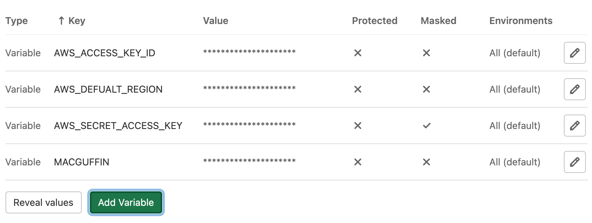

# Authorizing Deploys from GitLab to Kubernetes

*By the end of this lab, you will:*

- Configure your pipeline to deploy your custom webserver on your Kubernetes cluster
- Use GitLab CI/CD Variables
- Use a AWS IAM service account to connect to your cluster from GitLab

---

You have provided your Kubernetes cluster with credentials to the private container registry in your GitLab project.  But GitLab currently has no way to authenticate to your Kubernetes cluster to update the manifest.  We're going to create a service account to give GitLab access to both AWS and your cluster.
<!--
---

1. Application-specific environment management

  ```shell
  cd ~/sfs/mywebserver

  # Move our environment file to live with the application
  mv ~/sfs/.env ~/sfs/mywebserver/.env

  # Tell Git to ignore our local environment configuration
  echo ".env" >> ~/sfs/mywebserver/.gitignore

  git add .gitignore
  git commit -m 'ignore the local .env file'
  ```
-->
---

### Kubernetes Service Account

AWS IAM policy for enabling (but restricting) our service account

We're going to give our service account very restrictive permissions in regards to the AWS boundaries.  It will only be able to list and describe clusters.

But in regards to Kubernetes itself, we are giving FULL ADMIN ACCESS to the internals of the cluster.

```bash
touch ~/sfs/work-dir/cloud-infrastructure/aws-iam-k8s-svcacct-policy.json
edit ~/sfs/work-dir/cloud-infrastructure/aws-iam-k8s-svcacct-policy.json
```

Put this in the file:

```json
{
    "Version": "2012-10-17",
    "Statement": [
        {
            "Effect": "Allow",
            "Action": "eks:AccessKubernetesApi",
            "Resource": "arn:aws:eks:*:154063256304:cluster/*"
        },
        {
            "Effect": "Allow",
            "Action": [
                "eks:DescribeCluster",
                "eks:ListClusters"
            ],
            "Resource": "*"
        }
    ]
}
```

Now create the policy in AWS.  Note that we're using `tee` again to store the output of this command.

```bash
aws iam create-policy \
  --policy-name ${MACGUFFIN}-i2do-k8s-svc-account-policy \
  --policy-document file://~/sfs/work-dir/cloud-infrastructure/aws-iam-k8s-svcacct-policy.json \
  --output json \
  | tee ~/sfs/work-dir/cloud-infrastructure/policy-output.json
```

Create the service account

```bash
# Create the user with no permissions
aws iam create-user \
  --user-name ${MACGUFFIN}-i2do-k8s-svc-account \
  --output json \
  | tee ~/sfs/work-dir/cloud-infrastructure/create-user-output.json

# Associate the policy with the new service account.
# Note we're using the policy-output.json from the previous step to get the policy ARN.
aws iam attach-user-policy \
  --user-name ${MACGUFFIN}-i2do-k8s-svc-account \
  --policy-arn $( jq -r '.Policy.Arn' ~/sfs/work-dir/cloud-infrastructure/policy-output.json )

# Grant the service account permissions on the cluster
kubectl patch cm aws-auth \
  -n kube-system \
  --type merge \
  -p "{\"data\":{\"mapUsers\":\"- userarn: $(jq -r '.User.Arn' ~/sfs/work-dir/cloud-infrastructure/create-user-output.json)\n  username: $(jq -r '.User.UserName' ~/sfs/work-dir/cloud-infrastructure/create-user-output.json)\n  groups:\n    - system:masters\n\"}}"

# Create the Access Key for the service account
aws iam create-access-key --user-name ${MACGUFFIN}-i2do-k8s-svc-account
```

---

### Configuring the Service Account from GitLab

Navigate to `MyWebServer --> Settings --> CI/CD --> Variables`

```shell
echo "$( jq -r .web_url ~/sfs/repo_metadata.json )/-/settings/ci_cd"
```

1. `AWS_ACCESS_KEY_ID`
  - Create a new variable called `AWS_ACCESS_KEY_ID`, and paste the `AccessKeyId` value from the output of the `aws iam create-access-key` command above.  Deselect the `Protected` checkbox and save the variable.
2. `AWS_SECRET_ACCESS_KEY`
  - Create another new variable called `AWS_SECRET_ACCESS_KEY` and paste the `SecretAccessKey` value from the output of the `aws iam create-access-key` command above.  Deselect the `Protected` checkbox.  Select the `Masked` checkbox.  Save the variable.
3. `AWS_DEFAULT_REGION`
  - Add a third variable called `AWS_DEFAULT_REGION` with the value `us-west-2`.  Ensure both the `Protected` and `Masked` options are NOT selected.  Save the variable.
4. `MACGUFFIN`
  - Add one more variable: `MACGUFFIN`.  Type in your MacGuffin and ensure that neither `Protected` nor `Masked` are checked.



---

### Using the Service Account

Add a `deploy_webserver` job to your pipeline file

```bash
edit ~/sfs/mywebserver/.gitlab-ci.yml
```

```yaml
build_and_test_webserver:
  stage: build
  image: docker:stable
  services:
    - docker:dind
  script:
    - docker build -t ${CI_REGISTRY_IMAGE}:${CI_COMMIT_SHORT_SHA} -t ${CI_REGISTRY_IMAGE}:latest .
    - docker run -d -p8080:80 --name mywebserver ${CI_REGISTRY_IMAGE}:${CI_COMMIT_SHORT_SHA}
    - docker logs mywebserver
    - apk add curl
    - curl docker:8080
    - docker login -u gitlab-ci-token -p $CI_BUILD_TOKEN registry.gitlab.com
    - docker push ${CI_REGISTRY_IMAGE}
    - echo ${CI_REGISTRY_IMAGE}:${CI_COMMIT_SHORT_SHA}

deploy_webserver:
  stage: deploy
  image: aayore/aws-kubectl
  variables:
    # This uses the MACGUFFIN variable we set
    CLUSTER: ${MACGUFFIN}-k8s
  script:
    # Authenticate to the cluster
    # This uses the AWS* variables in the background
    - aws eks update-kubeconfig --name ${CLUSTER} --region ${AWS_DEFAULT_REGION}
    # Deploy any changes
    - kubectl apply -f webserver-manual.yaml
```

Commit your changes

```bash
cd ~/sfs/mywebserver
git add webserver-manual.yaml
git commit -m 'add the k8s deploy manifest'
git add .gitlab-ci.yml
git commit -m 'add a k8s deploy job to the pipeline'
# make a quick change to the website too!
echo 'Lab08 update!' > html/index.html
git add html/index.html
git commit -m 'update the web page for Lab 08'
git push
```

Check your pipeline status.

```shell
echo "$( jq -r '.web_url' ~/sfs/repo_metadata.json )/-/pipelines"
```

- Note that your pipeline now has two jobs: `build_and_test_webserver` as well as `deploy_webserver`

Look for the following in the output of the `deploy_webserver` job:

**Do not copy/paste this in your terminal.  Just look for it in the CI job output.**

```
$ aws eks update-kubeconfig --name ${CLUSTER} --region ${AWS_DEFAULT_REGION}
Added new context arn:aws:eks:us-west-2:154063256304:cluster/teacher-k8s-cluster to /root/.kube/config
$ kubectl apply -f webserver-manual.yaml
deployment.apps/mywebserver-dev unchanged
service/mywebserver-dev unchanged
ingress.networking.k8s.io/mywebserver-dev unchanged
Cleaning up file based variables
00:01
Job succeeded
```

---

| Previous: [K8s to GitLab Auth](/labs/07_auth_kubernetes_to_gitlab) | Next: [Automated Deployment](/labs/09_automated_deployment) |
|---:|:---|
